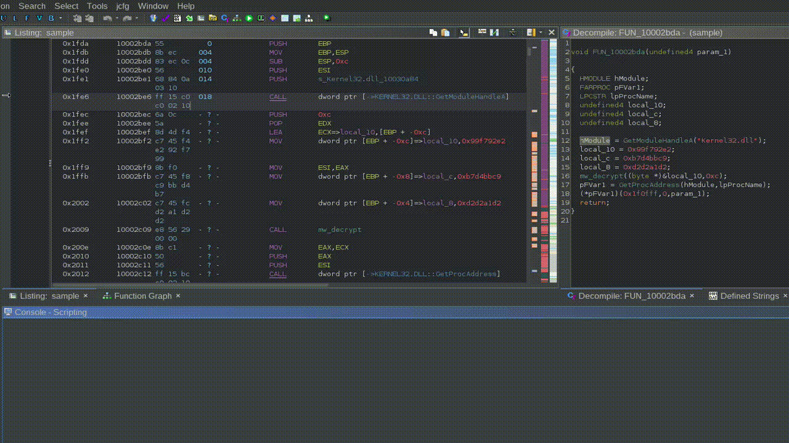

# ghidra_scripts
Ghidra Scripts for Reverse Engineering

## ByteRunner.py

Emulates the selected code using Unicorn. Tested in x86 and x64.

The script was developed to emulate the selected assembly and display all the registers that were changed during emulation, as well as any changes in the stack.

### Requirements

- [Ghidrathon](https://github.com/mandiant/Ghidrathon) (for Python 3 support)

### Installation

1. Clone (or download) the [repo](https://github.com/joaogodinho/ghidra_scripts) and place the `ByteRunner.py` script into your `ghidra_scripts` directory. 
2. Install Unicorn into Ghidraton's Python environment using `pip install -r requirements/byterunner.txt`.
3. Open Ghidra's Script Manager, go to the `jcfg` folder and enable the checkbox in the first column for `ByteRunner.py`. This adds the script to the toolbar.

### Usage

1. Start by selection the assembly to emulate in the Listing window, as shown below:
2. Press `F5` or go to `jcfg -> ByteRunner`.
3. In the Console window the script will print the addresses that will be emulated, followed by any registers that were changed during emulation, followed by an hex dump of any stack changes.

### Exclude Registers and Register Values

The window `Exclude Registers` allows the user to blacklist register by name. This can be useful when emulating something that uses many registers and one wants to have a less verbose output. It accepts a comma separated list of register names. To show all changed registers, just leave one `,`.

The window `Register Values` allows the user to set values for the registers before emulation. This can be helpful if a register value is set at a previous point which is not being emulated. It accepts a comma separated list with format `<reg>=0x<value>` like: `eax=0xdeadbeef`.

## MSDNSearch.py

Opens a browser tab with a search for the selected token in MSDN. Useful to quickly get to the documentation of Windows APIs.
